# Find the best classification model for your dataset

There are several classification models. In addition, they require tunning to get the best parameter for a given dataset. This task might get challenging, that is why I present a python library to get the best parameter from a group of classifiers. These classifiers are: K Neighbors Classifier, Support Vector Classifier, Decision Tree Classifier, Radorm Forest Classifier, Adaboost classifier.  
  
In the first part I use a library to merge dataframes containing foods' nutrition features. The source of this data is on: https://ndb.nal.usda.gov/ndb/ . I am not including the CSVs yet, since the data can get obtained from this source using a json format. In addition, I will post another publication of how to get the data.
  
I use tSNE to show how vegetables, fruits, beef and fishes are clustered.  
Afterwards, I show some examples of how to use the mentionated library **model_score_plot** . The function **msp.modelsCalculation** allows to get at once the best setting parameters for all the said classifiers.  
  
To see more information please type **help(model_score_plot)** after importing.


```python
import pandas as pd
import os
from sklearn.manifold import TSNE
import matplotlib.pyplot as plt
import numpy as np

from sklearn.model_selection import train_test_split
from sklearn.metrics import confusion_matrix
from sklearn.metrics import classification_report
import imp
import sys
sys.path.insert(0, 'PyLib')

#A modified library from the internet suitet to this demonstration
import plot_confusion_matrix_compact 
imp.reload(plot_confusion_matrix_compact)
from plot_confusion_matrix_compact import plot_confusion_matrix

#The mentioned library
import model_score_plot
imp.reload(model_score_plot)
from model_score_plot import ModelScorePlot as MSP

#Library to merge dataframes and show a tSNE image
import df_proc
imp.reload(df_proc)
from df_proc import *
```

# Prepare Dataset


```python
csvDir='CSVs'
beef_df=pd.read_csv(csvDir+'/'+'beef_df_100g.csv',sep=',',index_col=0)
fish_df=pd.read_csv(csvDir+'/'+'fish_df_100g.csv',sep=',',index_col=0)
veg_df=pd.read_csv(csvDir+'/'+'veg_df_100g.csv',sep=',',index_col=0)
fruit_df=pd.read_csv(csvDir+'/'+'fruit_df_100g.csv',sep=',',index_col=0)
dfL=[beef_df,fish_df,fruit_df,veg_df]
typesL=['beef','fish','fruit','vegetable']
colorL=['black','blue','red','green']
colorL=['black','blue','red','green']
dataDic=combineDfs(iDfL=dfL,typesL=typesL,colorL=colorL,figSize=(50,50),iDpi=80,plotText=False)
```


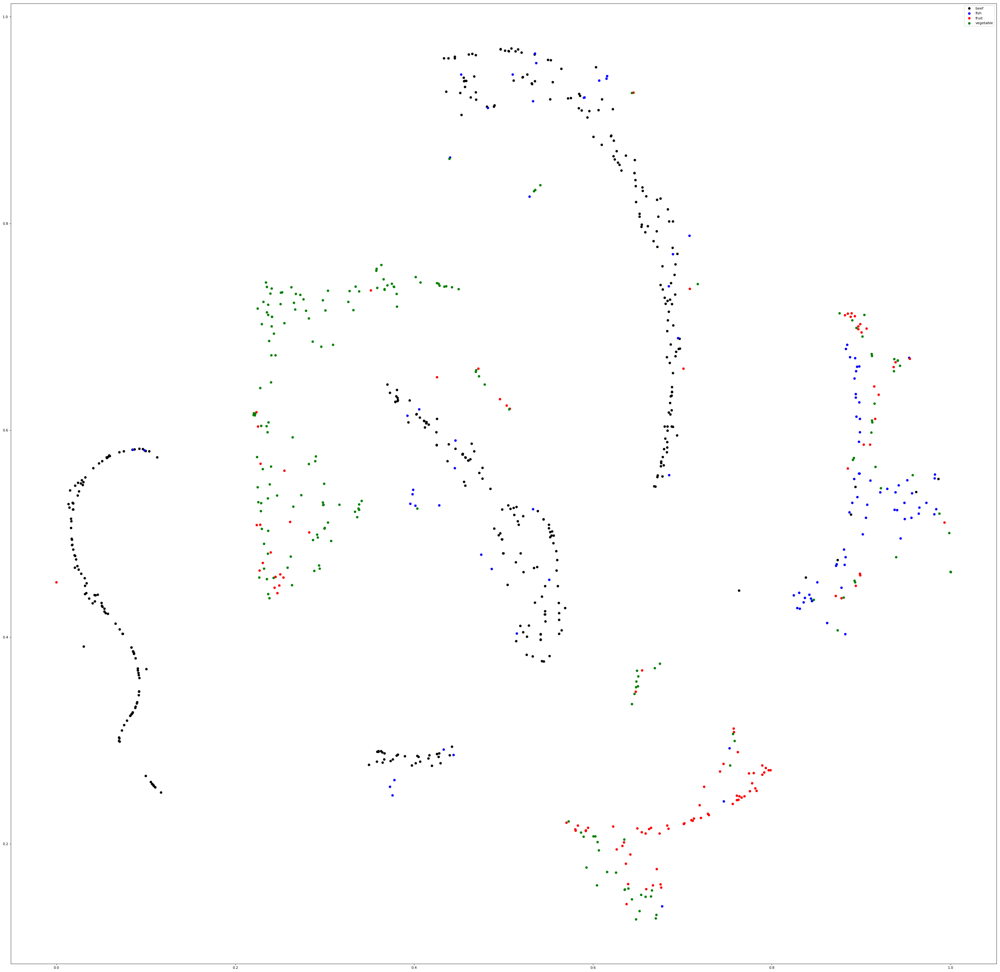


```python
dataDic['df'].head(3)
```


<div>
<table border="1" class="dataframe">
  <thead>
    <tr style="text-align: right;">
      <th></th>
      <th>Proximates Water g</th>
      <th>Proximates Energy kcal</th>
      <th>Proximates Energy kJ</th>
      <th>Proximates Protein g</th>
      <th>Proximates Total lipid (fat) g</th>
      <th>Proximates Ash g</th>
      <th>Proximates Carbohydrate, by difference g</th>
      <th>Minerals Calcium, Ca mg</th>
      <th>Minerals Iron, Fe mg</th>
      <th>type</th>
    </tr>
  </thead>
  <tbody>
    <tr>
      <th>Beef_ribeye_cap_steak_boneless_separable_lean_only_trimmed_to_0"_fat_choice_raw</th>
      <td>66.50</td>
      <td>187.0</td>
      <td>784.0</td>
      <td>19.46</td>
      <td>11.40</td>
      <td>0.89</td>
      <td>1.75</td>
      <td>6.0</td>
      <td>2.64</td>
      <td>beef</td>
    </tr>
    <tr>
      <th>Beef_loin_tenderloin_steak_boneless_separable_lean_only_trimmed_to_0"_fat_choice_raw</th>
      <td>72.04</td>
      <td>143.0</td>
      <td>597.0</td>
      <td>21.78</td>
      <td>6.16</td>
      <td>1.11</td>
      <td>0.00</td>
      <td>13.0</td>
      <td>2.55</td>
      <td>beef</td>
    </tr>
    <tr>
      <th>Beef_rib_eye_steakslashroast_boneless_lip-on_separable_lean_only_trimmed_to_1slash8"_fat_select_raw</th>
      <td>70.89</td>
      <td>148.0</td>
      <td>619.0</td>
      <td>22.55</td>
      <td>6.41</td>
      <td>1.03</td>
      <td>0.00</td>
      <td>5.0</td>
      <td>1.80</td>
      <td>beef</td>
    </tr>
  </tbody>
</table>
</div>


```python

```


```python
cols=list(dataDic['df'].columns.values)
colsX=cols.copy()
colsX.remove('type')
labels=list(set(dataDic['df']['type'].values))
print(cols)
print(labels)
print(colsX)
X=dataDic['df'][colsX].values
y=dataDic['df']['type'].values
for i,t in enumerate(labels):
    y[y==t]=i
y=y.flatten().astype(int)
X=X.astype(float)

mms=MinMaxScaler()
Xn=mms.fit_transform(X)
```

    ['Proximates Water g', 'Proximates Energy kcal', 'Proximates Energy kJ', 'Proximates Protein g', 'Proximates Total lipid (fat) g', 'Proximates Ash g', 'Proximates Carbohydrate, by difference g', 'Minerals Calcium, Ca mg', 'Minerals Iron, Fe mg', 'type']
    ['vegetable', 'beef', 'fish', 'fruit']
    ['Proximates Water g', 'Proximates Energy kcal', 'Proximates Energy kJ', 'Proximates Protein g', 'Proximates Total lipid (fat) g', 'Proximates Ash g', 'Proximates Carbohydrate, by difference g', 'Minerals Calcium, Ca mg', 'Minerals Iron, Fe mg']


# Create a Model Score Plot object


```python
msp = MSP()
```

# K Neighbors Classifier


```python
knc_df=msp.kncScores(Xn,y,cv=5,param_name='n_neighbors',paramRange=(1,100,1),trainW=1,testW=2,title='KNC',plot=True)
```


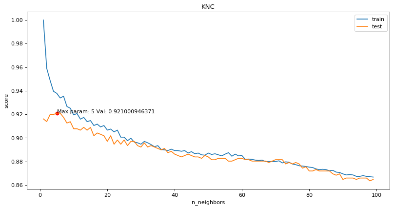


```python
knc_df
```


<div>
<table border="1" class="dataframe">
  <thead>
    <tr style="text-align: right;">
      <th></th>
      <th>best_param</th>
      <th>model</th>
      <th>param_name</th>
      <th>test_score</th>
      <th>train_score</th>
      <th>weighted_score</th>
    </tr>
  </thead>
  <tbody>
    <tr>
      <th>0</th>
      <td>5</td>
      <td>SVC poly5</td>
      <td>n_neighbors</td>
      <td>0.921001</td>
      <td>0.937735</td>
      <td>0.926579</td>
    </tr>
  </tbody>
</table>
</div>


# SVC

Reference:  
http://scikit-learn.org/stable/modules/generated/sklearn.svm.SVC.html#sklearn.svm.SVC


```python
svc_df=msp.svcScores(Xn,y,cv=5,param_name='C',max_iter=50000,degrees=(2,4,1),paramRange=(100,1000,100),plot=True)
```


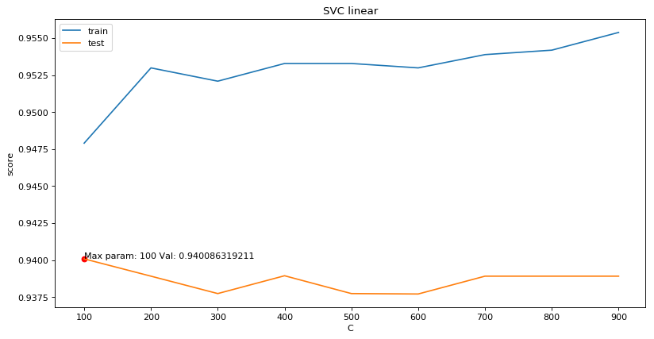


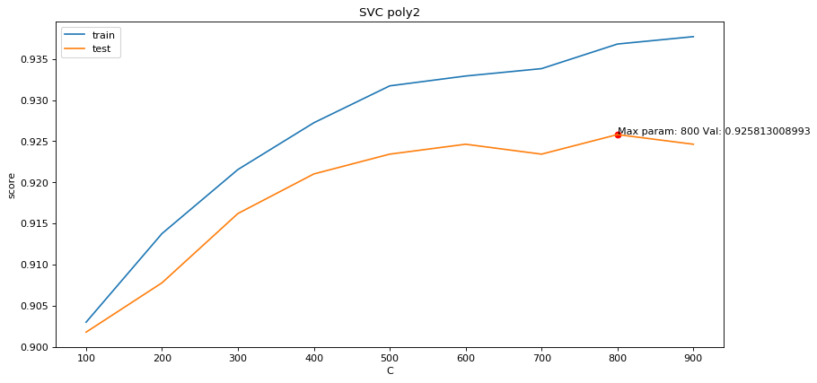


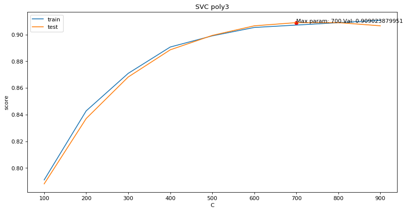


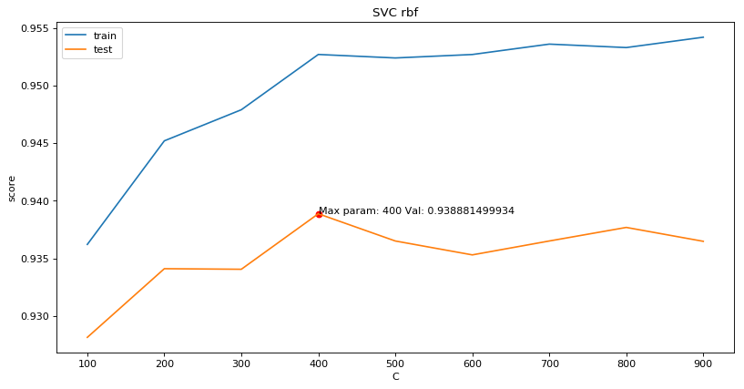


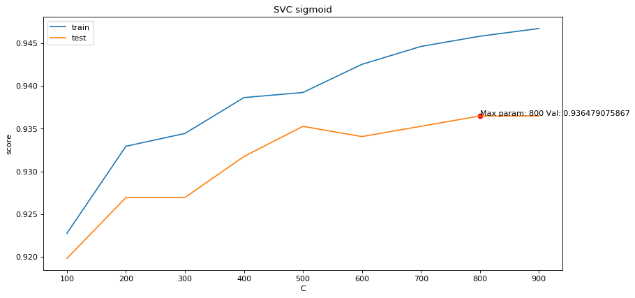


```python
svc_df
```


<div>
<table border="1" class="dataframe">
  <thead>
    <tr style="text-align: right;">
      <th></th>
      <th>best_param</th>
      <th>model</th>
      <th>param_name</th>
      <th>test_score</th>
      <th>train_score</th>
      <th>weighted_score</th>
    </tr>
  </thead>
  <tbody>
    <tr>
      <th>3</th>
      <td>400</td>
      <td>SVC rbf</td>
      <td>C</td>
      <td>0.938881</td>
      <td>0.952694</td>
      <td>0.943486</td>
    </tr>
    <tr>
      <th>0</th>
      <td>100</td>
      <td>SVC linear</td>
      <td>C</td>
      <td>0.940086</td>
      <td>0.947906</td>
      <td>0.942693</td>
    </tr>
    <tr>
      <th>4</th>
      <td>800</td>
      <td>SVC sigmoid</td>
      <td>C</td>
      <td>0.936479</td>
      <td>0.945807</td>
      <td>0.939588</td>
    </tr>
    <tr>
      <th>1</th>
      <td>800</td>
      <td>SVC poly2</td>
      <td>C</td>
      <td>0.925813</td>
      <td>0.936825</td>
      <td>0.929484</td>
    </tr>
    <tr>
      <th>2</th>
      <td>700</td>
      <td>SVC poly3</td>
      <td>C</td>
      <td>0.909024</td>
      <td>0.907187</td>
      <td>0.908412</td>
    </tr>
  </tbody>
</table>
</div>


# Decision tree classifier


```python
dtc_df=msp.dtcScores(Xn,y,cv=5,param_name='max_depth',paramRange=(1,10,1),trainW=1,testW=2,title='Decision Tree classifier',plot=True)
dtc_df
```


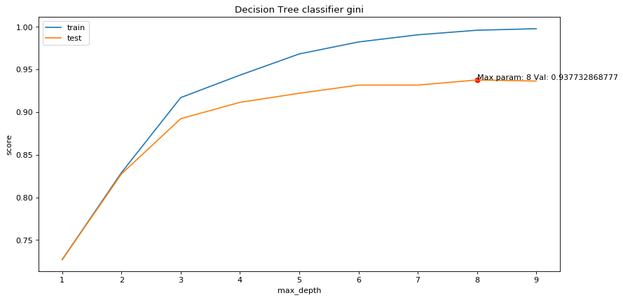


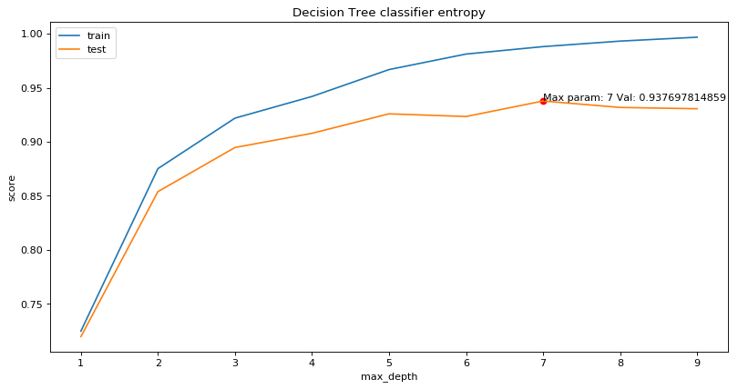


<div>
<table border="1" class="dataframe">
  <thead>
    <tr style="text-align: right;">
      <th></th>
      <th>best_param</th>
      <th>model</th>
      <th>param_name</th>
      <th>test_score</th>
      <th>train_score</th>
      <th>weighted_score</th>
    </tr>
  </thead>
  <tbody>
    <tr>
      <th>0</th>
      <td>8</td>
      <td>Decision Tree classifier gini</td>
      <td>max_depth</td>
      <td>0.937733</td>
      <td>0.996106</td>
      <td>0.957191</td>
    </tr>
    <tr>
      <th>1</th>
      <td>7</td>
      <td>Decision Tree classifier entropy</td>
      <td>max_depth</td>
      <td>0.937698</td>
      <td>0.988019</td>
      <td>0.954472</td>
    </tr>
  </tbody>
</table>
</div>


# Random Forest Classifier


```python
rfc_df=msp.rfcScores(Xn,y,cv=5,param_name='max_depth',estimatorsRange=(2,11,1),paramRange=(1,15,1),trainW=1,testW=2,title='Randorm Forest classifier',clfArg={},plot=True)
```


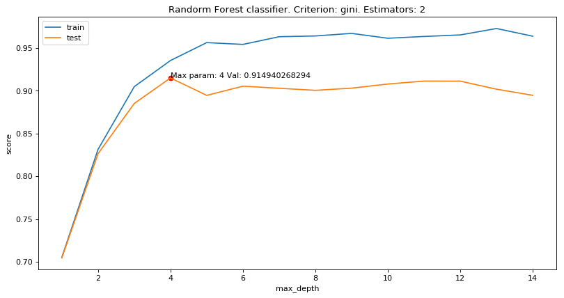


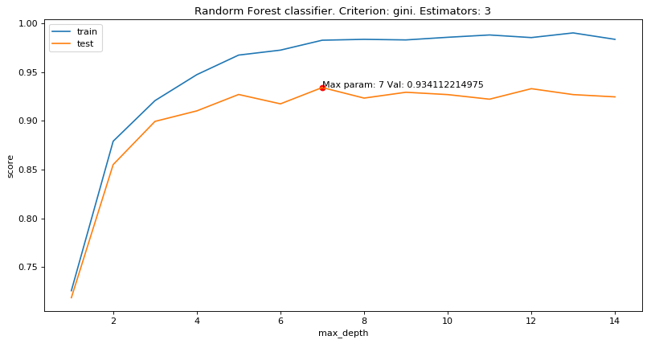


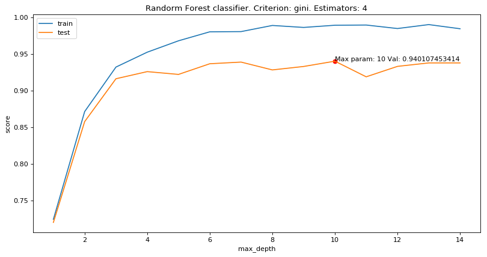


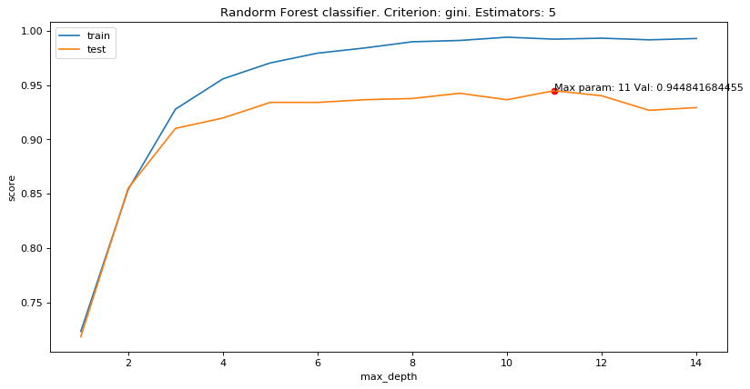


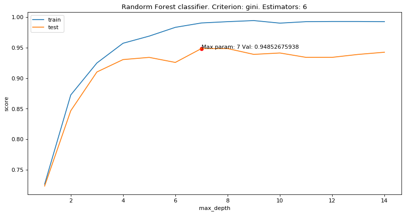


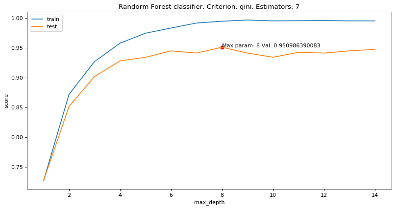


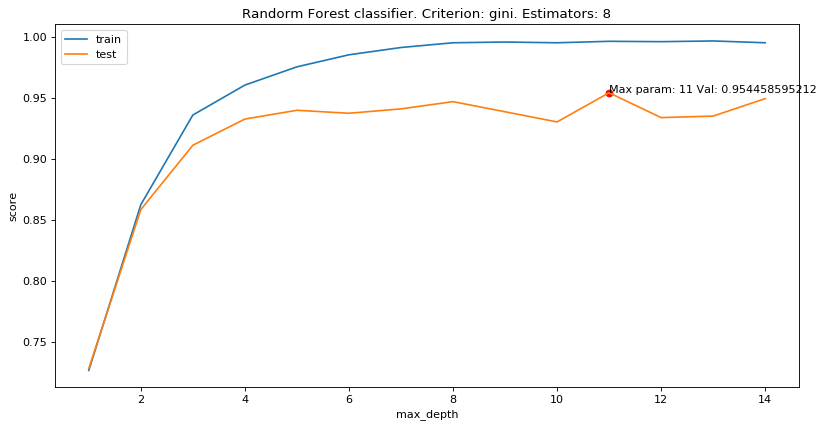


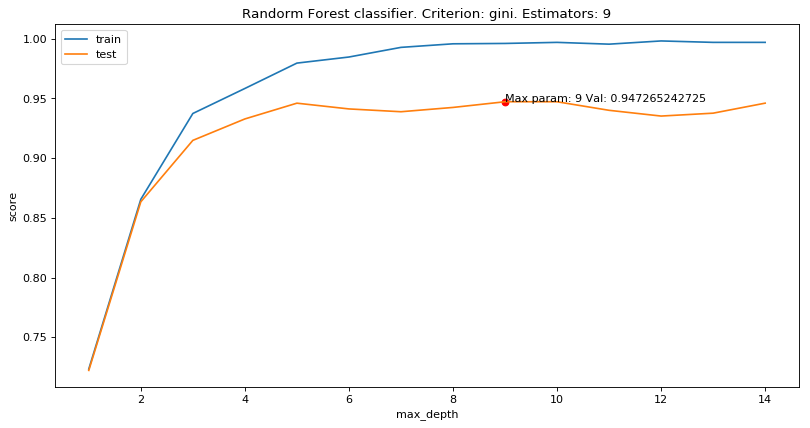


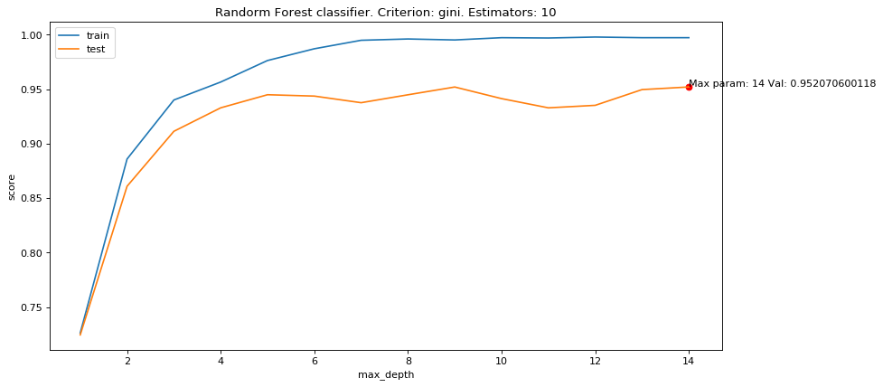


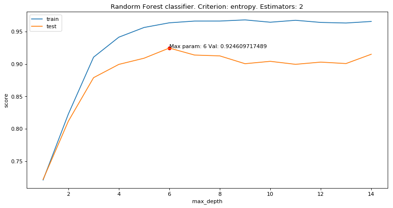


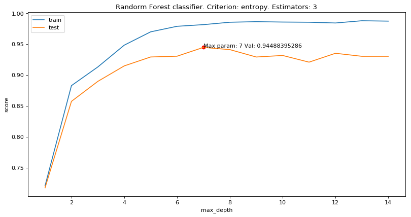


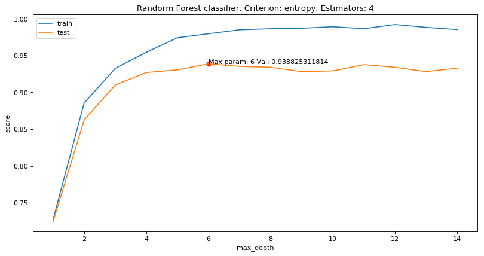


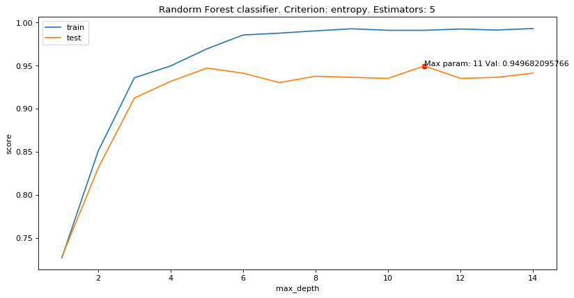


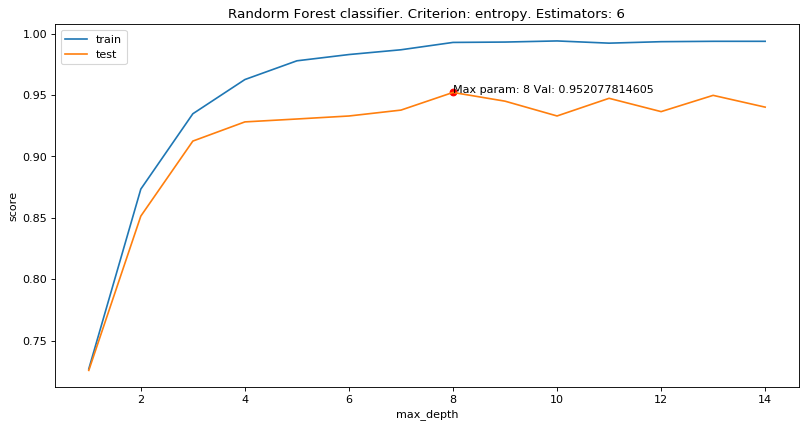


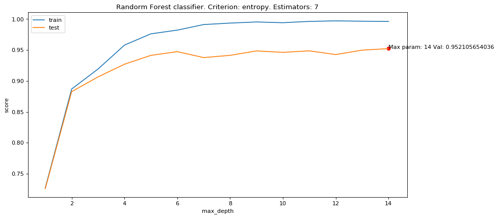


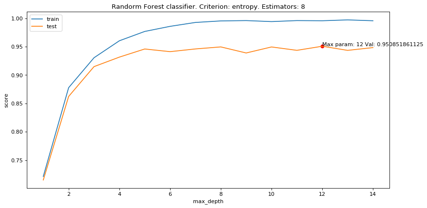


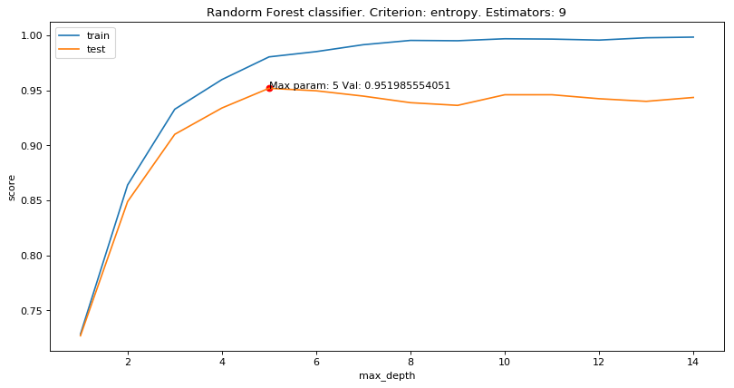


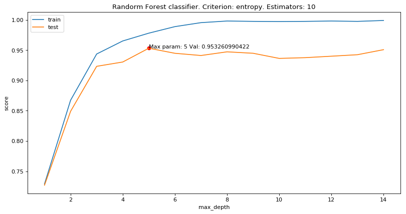


```python
rfc_df
```


<div>
<table border="1" class="dataframe">
  <thead>
    <tr style="text-align: right;">
      <th></th>
      <th>best_param</th>
      <th>model</th>
      <th>param_name</th>
      <th>test_score</th>
      <th>train_score</th>
      <th>weighted_score</th>
    </tr>
  </thead>
  <tbody>
    <tr>
      <th>6</th>
      <td>11</td>
      <td>Randorm Forest classifier. Criterion: gini. Es...</td>
      <td>max_depth</td>
      <td>0.954459</td>
      <td>0.996706</td>
      <td>0.968541</td>
    </tr>
    <tr>
      <th>8</th>
      <td>14</td>
      <td>Randorm Forest classifier. Criterion: gini. Es...</td>
      <td>max_depth</td>
      <td>0.952071</td>
      <td>0.997308</td>
      <td>0.967150</td>
    </tr>
    <tr>
      <th>14</th>
      <td>14</td>
      <td>Randorm Forest classifier. Criterion: entropy....</td>
      <td>max_depth</td>
      <td>0.952106</td>
      <td>0.996103</td>
      <td>0.966771</td>
    </tr>
    <tr>
      <th>15</th>
      <td>12</td>
      <td>Randorm Forest classifier. Criterion: entropy....</td>
      <td>max_depth</td>
      <td>0.950852</td>
      <td>0.995804</td>
      <td>0.965836</td>
    </tr>
    <tr>
      <th>13</th>
      <td>8</td>
      <td>Randorm Forest classifier. Criterion: entropy....</td>
      <td>max_depth</td>
      <td>0.952078</td>
      <td>0.992813</td>
      <td>0.965656</td>
    </tr>
    <tr>
      <th>5</th>
      <td>8</td>
      <td>Randorm Forest classifier. Criterion: gini. Es...</td>
      <td>max_depth</td>
      <td>0.950986</td>
      <td>0.994608</td>
      <td>0.965527</td>
    </tr>
    <tr>
      <th>7</th>
      <td>9</td>
      <td>Randorm Forest classifier. Criterion: gini. Es...</td>
      <td>max_depth</td>
      <td>0.947265</td>
      <td>0.996107</td>
      <td>0.963546</td>
    </tr>
    <tr>
      <th>12</th>
      <td>11</td>
      <td>Randorm Forest classifier. Criterion: entropy....</td>
      <td>max_depth</td>
      <td>0.949682</td>
      <td>0.991015</td>
      <td>0.963460</td>
    </tr>
    <tr>
      <th>4</th>
      <td>7</td>
      <td>Randorm Forest classifier. Criterion: gini. Es...</td>
      <td>max_depth</td>
      <td>0.948527</td>
      <td>0.990404</td>
      <td>0.962486</td>
    </tr>
    <tr>
      <th>17</th>
      <td>5</td>
      <td>Randorm Forest classifier. Criterion: entropy....</td>
      <td>max_depth</td>
      <td>0.953261</td>
      <td>0.978150</td>
      <td>0.961557</td>
    </tr>
    <tr>
      <th>16</th>
      <td>5</td>
      <td>Randorm Forest classifier. Criterion: entropy....</td>
      <td>max_depth</td>
      <td>0.951986</td>
      <td>0.980534</td>
      <td>0.961502</td>
    </tr>
    <tr>
      <th>3</th>
      <td>11</td>
      <td>Randorm Forest classifier. Criterion: gini. Es...</td>
      <td>max_depth</td>
      <td>0.944842</td>
      <td>0.992211</td>
      <td>0.960631</td>
    </tr>
    <tr>
      <th>10</th>
      <td>7</td>
      <td>Randorm Forest classifier. Criterion: entropy....</td>
      <td>max_depth</td>
      <td>0.944884</td>
      <td>0.981743</td>
      <td>0.957170</td>
    </tr>
    <tr>
      <th>2</th>
      <td>10</td>
      <td>Randorm Forest classifier. Criterion: gini. Es...</td>
      <td>max_depth</td>
      <td>0.940107</td>
      <td>0.989223</td>
      <td>0.956479</td>
    </tr>
    <tr>
      <th>11</th>
      <td>6</td>
      <td>Randorm Forest classifier. Criterion: entropy....</td>
      <td>max_depth</td>
      <td>0.938825</td>
      <td>0.979630</td>
      <td>0.952427</td>
    </tr>
    <tr>
      <th>1</th>
      <td>7</td>
      <td>Randorm Forest classifier. Criterion: gini. Es...</td>
      <td>max_depth</td>
      <td>0.934112</td>
      <td>0.982631</td>
      <td>0.950285</td>
    </tr>
    <tr>
      <th>9</th>
      <td>6</td>
      <td>Randorm Forest classifier. Criterion: entropy....</td>
      <td>max_depth</td>
      <td>0.924610</td>
      <td>0.963467</td>
      <td>0.937562</td>
    </tr>
    <tr>
      <th>0</th>
      <td>4</td>
      <td>Randorm Forest classifier. Criterion: gini. Es...</td>
      <td>max_depth</td>
      <td>0.914940</td>
      <td>0.935347</td>
      <td>0.921743</td>
    </tr>
  </tbody>
</table>
</div>


# Adaboost Classifier

Reference:  
http://scikit-learn.org/stable/modules/generated/sklearn.ensemble.AdaBoostClassifier.html#sklearn.ensemble.AdaBoostClassifier  


```python
abc_df=msp.abcScores(Xn,y,cv=5,param_name='n_estimators',paramRange=(1,10,1),trainW=1,testW=2,title='Adaboost classifier',clfArg={},plot=True)
```


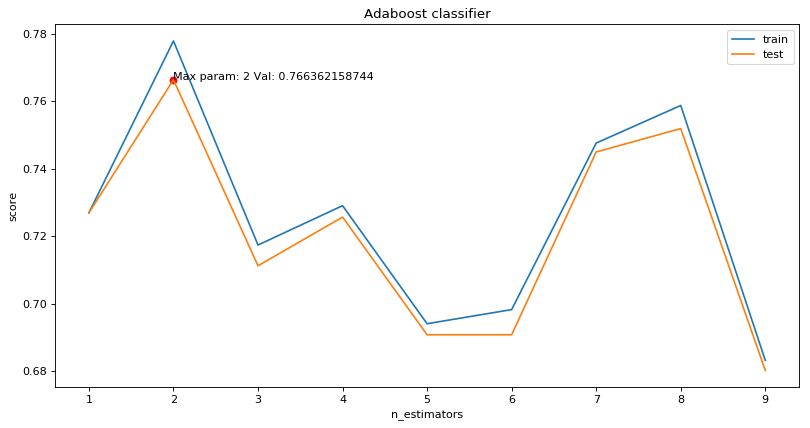


```python
abc_df
```


<div>
<table border="1" class="dataframe">
  <thead>
    <tr style="text-align: right;">
      <th></th>
      <th>best_param</th>
      <th>model</th>
      <th>param_name</th>
      <th>test_score</th>
      <th>train_score</th>
      <th>weighted_score</th>
    </tr>
  </thead>
  <tbody>
    <tr>
      <th>0</th>
      <td>2</td>
      <td>Adaboost classifier</td>
      <td>n_estimators</td>
      <td>0.766362</td>
      <td>0.777865</td>
      <td>0.770196</td>
    </tr>
  </tbody>
</table>
</div>


```python
models=[knc_df,svc_df,dtc_df,rfc_df,abc_df]
pd.concat(models).sort_values(by='weighted_score',ascending=False)
```


<div>
<table border="1" class="dataframe">
  <thead>
    <tr style="text-align: right;">
      <th></th>
      <th>best_param</th>
      <th>model</th>
      <th>param_name</th>
      <th>test_score</th>
      <th>train_score</th>
      <th>weighted_score</th>
    </tr>
  </thead>
  <tbody>
    <tr>
      <th>5</th>
      <td>14</td>
      <td>Randorm Forest classifier. Estimators: 7</td>
      <td>max_depth</td>
      <td>0.958066</td>
      <td>0.995210</td>
      <td>0.970447</td>
    </tr>
    <tr>
      <th>8</th>
      <td>6</td>
      <td>Randorm Forest classifier. Estimators: 10</td>
      <td>max_depth</td>
      <td>0.952141</td>
      <td>0.987423</td>
      <td>0.963902</td>
    </tr>
    <tr>
      <th>6</th>
      <td>9</td>
      <td>Randorm Forest classifier. Estimators: 8</td>
      <td>max_depth</td>
      <td>0.948484</td>
      <td>0.994608</td>
      <td>0.963859</td>
    </tr>
    <tr>
      <th>7</th>
      <td>6</td>
      <td>Randorm Forest classifier. Estimators: 9</td>
      <td>max_depth</td>
      <td>0.948477</td>
      <td>0.990122</td>
      <td>0.962359</td>
    </tr>
    <tr>
      <th>4</th>
      <td>7</td>
      <td>Randorm Forest classifier. Estimators: 6</td>
      <td>max_depth</td>
      <td>0.944891</td>
      <td>0.988020</td>
      <td>0.959268</td>
    </tr>
    <tr>
      <th>3</th>
      <td>6</td>
      <td>Randorm Forest classifier. Estimators: 5</td>
      <td>max_depth</td>
      <td>0.948435</td>
      <td>0.979036</td>
      <td>0.958635</td>
    </tr>
    <tr>
      <th>2</th>
      <td>11</td>
      <td>Randorm Forest classifier. Estimators: 4</td>
      <td>max_depth</td>
      <td>0.940178</td>
      <td>0.987420</td>
      <td>0.955925</td>
    </tr>
    <tr>
      <th>0</th>
      <td>6</td>
      <td>Decision Tree classifier</td>
      <td>max_depth</td>
      <td>0.936564</td>
      <td>0.982339</td>
      <td>0.951822</td>
    </tr>
    <tr>
      <th>1</th>
      <td>5</td>
      <td>Randorm Forest classifier. Estimators: 3</td>
      <td>max_depth</td>
      <td>0.941284</td>
      <td>0.966166</td>
      <td>0.949578</td>
    </tr>
    <tr>
      <th>3</th>
      <td>400</td>
      <td>SVC rbf</td>
      <td>C</td>
      <td>0.938881</td>
      <td>0.952694</td>
      <td>0.943486</td>
    </tr>
    <tr>
      <th>0</th>
      <td>100</td>
      <td>SVC linear</td>
      <td>C</td>
      <td>0.940086</td>
      <td>0.947906</td>
      <td>0.942693</td>
    </tr>
    <tr>
      <th>4</th>
      <td>800</td>
      <td>SVC sigmoid</td>
      <td>C</td>
      <td>0.936479</td>
      <td>0.945807</td>
      <td>0.939588</td>
    </tr>
    <tr>
      <th>1</th>
      <td>800</td>
      <td>SVC poly2</td>
      <td>C</td>
      <td>0.925813</td>
      <td>0.936825</td>
      <td>0.929484</td>
    </tr>
    <tr>
      <th>0</th>
      <td>12</td>
      <td>Randorm Forest classifier. Estimators: 2</td>
      <td>max_depth</td>
      <td>0.910207</td>
      <td>0.962560</td>
      <td>0.927658</td>
    </tr>
    <tr>
      <th>0</th>
      <td>5</td>
      <td>KNC</td>
      <td>n_neighbors</td>
      <td>0.921001</td>
      <td>0.937735</td>
      <td>0.926579</td>
    </tr>
    <tr>
      <th>2</th>
      <td>700</td>
      <td>SVC poly3</td>
      <td>C</td>
      <td>0.909024</td>
      <td>0.907187</td>
      <td>0.908412</td>
    </tr>
    <tr>
      <th>0</th>
      <td>2</td>
      <td>Adaboost classifier</td>
      <td>n_estimators</td>
      <td>0.766362</td>
      <td>0.777865</td>
      <td>0.770196</td>
    </tr>
  </tbody>
</table>
</div>


# Selecion of best model and classification reports


```python
X_train, X_test, y_train, y_test = train_test_split(Xn,y)
rfc=RFC(max_depth=14,n_estimators=7)
rfc.fit(X_train,y_train)
y_pred=rfc.predict(X_test)
conf_matr=confusion_matrix(y_test, y_pred)
print(confusion_matrix(y_test, y_pred))
print(classification_report(y_test, y_pred,target_names=labels))
```

    [[103   0   0   0]
     [  0  23   0   4]
     [  1   0  25   0]
     [  1   4   0  48]]
                 precision    recall  f1-score   support
    
           beef       0.98      1.00      0.99       103
          fruit       0.85      0.85      0.85        27
           fish       1.00      0.96      0.98        26
      vegetable       0.92      0.91      0.91        53
    
    avg / total       0.95      0.95      0.95       209
    


```python
pcmc.plot_confusion_matrix(conf_matr,labels,normalize=False)
```

    Confusion matrix, without normalization


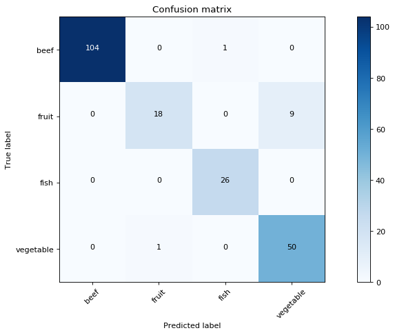


# Run all the models to get scores at once


```python
models_df=msp.modelsCalculation(Xn,y,abc={'paramRange':(2,20,2)},rfc={'estimatorsRange':(10,20,1),'paramRange':(1,20,1)},dtc={'paramRange':(1,20,1)})
models_df
```


<div>
<table border="1" class="dataframe">
  <thead>
    <tr style="text-align: right;">
      <th></th>
      <th>best_param</th>
      <th>model</th>
      <th>param_name</th>
      <th>test_score</th>
      <th>train_score</th>
      <th>weighted_score</th>
    </tr>
  </thead>
  <tbody>
    <tr>
      <th>8</th>
      <td>18</td>
      <td>Randorm Forest classifier. Estimators: 18</td>
      <td>max_depth</td>
      <td>0.955635</td>
      <td>0.998205</td>
      <td>0.969825</td>
    </tr>
    <tr>
      <th>9</th>
      <td>14</td>
      <td>Randorm Forest classifier. Estimators: 19</td>
      <td>max_depth</td>
      <td>0.954473</td>
      <td>0.999101</td>
      <td>0.969349</td>
    </tr>
    <tr>
      <th>6</th>
      <td>12</td>
      <td>Randorm Forest classifier. Estimators: 16</td>
      <td>max_depth</td>
      <td>0.954466</td>
      <td>0.998804</td>
      <td>0.969245</td>
    </tr>
    <tr>
      <th>5</th>
      <td>16</td>
      <td>Randorm Forest classifier. Estimators: 15</td>
      <td>max_depth</td>
      <td>0.954494</td>
      <td>0.998499</td>
      <td>0.969163</td>
    </tr>
    <tr>
      <th>2</th>
      <td>16</td>
      <td>Randorm Forest classifier. Estimators: 12</td>
      <td>max_depth</td>
      <td>0.954466</td>
      <td>0.997906</td>
      <td>0.968946</td>
    </tr>
    <tr>
      <th>7</th>
      <td>19</td>
      <td>Randorm Forest classifier. Estimators: 17</td>
      <td>max_depth</td>
      <td>0.953289</td>
      <td>0.999701</td>
      <td>0.968760</td>
    </tr>
    <tr>
      <th>3</th>
      <td>10</td>
      <td>Randorm Forest classifier. Estimators: 13</td>
      <td>max_depth</td>
      <td>0.952063</td>
      <td>0.998505</td>
      <td>0.967544</td>
    </tr>
    <tr>
      <th>1</th>
      <td>14</td>
      <td>Randorm Forest classifier. Estimators: 11</td>
      <td>max_depth</td>
      <td>0.950837</td>
      <td>0.998503</td>
      <td>0.966726</td>
    </tr>
    <tr>
      <th>4</th>
      <td>19</td>
      <td>Randorm Forest classifier. Estimators: 14</td>
      <td>max_depth</td>
      <td>0.950887</td>
      <td>0.998202</td>
      <td>0.966659</td>
    </tr>
    <tr>
      <th>0</th>
      <td>17</td>
      <td>Randorm Forest classifier. Estimators: 10</td>
      <td>max_depth</td>
      <td>0.950922</td>
      <td>0.997601</td>
      <td>0.966482</td>
    </tr>
    <tr>
      <th>0</th>
      <td>13</td>
      <td>Decision Tree classifier</td>
      <td>max_depth</td>
      <td>0.937733</td>
      <td>1.000000</td>
      <td>0.958489</td>
    </tr>
    <tr>
      <th>0</th>
      <td>5</td>
      <td>KNC</td>
      <td>n_neighbors</td>
      <td>0.921001</td>
      <td>0.937735</td>
      <td>0.926579</td>
    </tr>
    <tr>
      <th>0</th>
      <td>8</td>
      <td>SVC linear</td>
      <td>C</td>
      <td>0.919817</td>
      <td>0.920061</td>
      <td>0.919899</td>
    </tr>
    <tr>
      <th>5</th>
      <td>9</td>
      <td>SVC rbf</td>
      <td>C</td>
      <td>0.892192</td>
      <td>0.895507</td>
      <td>0.893297</td>
    </tr>
    <tr>
      <th>6</th>
      <td>9</td>
      <td>SVC sigmoid</td>
      <td>C</td>
      <td>0.850308</td>
      <td>0.853003</td>
      <td>0.851206</td>
    </tr>
    <tr>
      <th>0</th>
      <td>2</td>
      <td>Adaboost classifier</td>
      <td>n_estimators</td>
      <td>0.766362</td>
      <td>0.777865</td>
      <td>0.770196</td>
    </tr>
    <tr>
      <th>1</th>
      <td>9</td>
      <td>SVC poly2</td>
      <td>C</td>
      <td>0.734166</td>
      <td>0.735332</td>
      <td>0.734555</td>
    </tr>
    <tr>
      <th>2</th>
      <td>6</td>
      <td>SVC poly3</td>
      <td>C</td>
      <td>0.730580</td>
      <td>0.730243</td>
      <td>0.730467</td>
    </tr>
    <tr>
      <th>4</th>
      <td>1</td>
      <td>SVC poly5</td>
      <td>C</td>
      <td>0.492236</td>
      <td>0.492217</td>
      <td>0.492230</td>
    </tr>
    <tr>
      <th>3</th>
      <td>1</td>
      <td>SVC poly4</td>
      <td>C</td>
      <td>0.492236</td>
      <td>0.492217</td>
      <td>0.492230</td>
    </tr>
  </tbody>
</table>
</div>


# References

http://scikit-learn.org/stable/modules/generated/sklearn.preprocessing.MinMaxScaler.html  
http://scikit-learn.org/stable/model_selection.html  
http://scikit-learn.org/stable/modules/generated/sklearn.svm.SVC.html#sklearn.svm.SVC  
http://scikit-learn.org/stable/auto_examples/classification/plot_classifier_comparison.html  
http://scikit-learn.org/stable/modules/classes.html  
http://scikit-learn.org/stable/auto_examples/model_selection/plot_confusion_matrix.html#sphx-glr-auto-examples-model-selection-plot-confusion-matrix-py  
http://scikit-learn.org/stable/modules/generated/sklearn.metrics.classification_report.html#sklearn.metrics.classification_report  
https://github.com/andreashsieh/stacked_generalization  
https://stackoverflow.com/questions/37095246/how-to-use-adaboost-with-different-base-estimator-in-scikit-learn


```python

```
